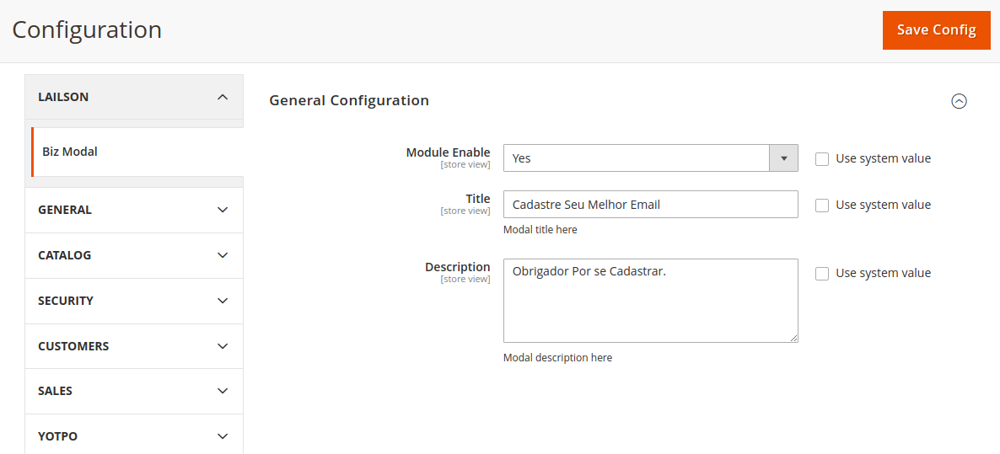
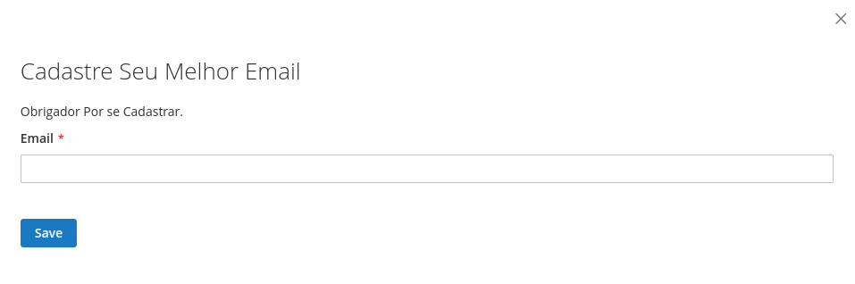
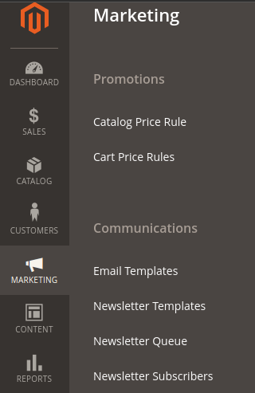

# Lailson-Biz

O `Lailson Biz` foi criado para adicionar novas funcionalidades a qualquer coisa relacionada a emails dos  clientes no Magento.

## Funcionalidades

* [x] Salvar os dados pelo admin do modulo, atualizando no Front-end.
* [x] Cadastrar email dos clientes no Newsletter.

## Configurações

As configuações do módulo ficam localizadas dentro do menu `Lojas > Configurações > Lailson > Biz Modal`.
 

## Explicando Cada Campo do Modulo.

- `Module Enable` -  Verifica se o Modulo Esta Habilitado.
- `Title` -  Titulo que Sera renderizado no Front-ent.
- `Description` -  Descrição que Sera renderizado no Front-ent.

- Todos os Campos podem ser atualizados que sera salvo no banco de acordo com a necessidade.

## Explicando a Parte FrontEnd.

- `Title` -  o Titulo que e renderizado no Front-ent foi cadastrado no admin do modulo e salvo no banco.
- `Description` -  a Descrição ue e renderizado no Front-ent foi cadastrado no admin do modulo e salvo no banco.
-  `Email` -  Email que sera salvo no banco.

## Explicando onde e salvo os emails no admin.

- Para Observar onde sera salvo os emails cadastrado pelo front localizadas dentro do menu `Marketing > Newsletter Subscribes `.

- E Mostrado todos os Emails cadastrado no front da loja, assim sendo possivel observar que esta funcionando corretamente.

- O proposito Do Modulo Foi desenvolver atualizações de dados tanto do lado do admin da loja, quando pelo front, assim sendo salvo de ambos os lados.  
